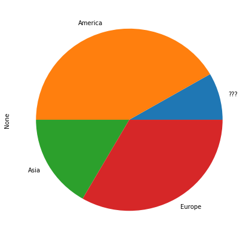
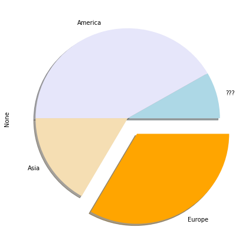
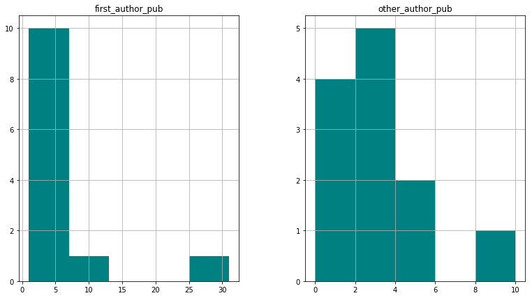

Written by Nadège Guiglielmoni.

This notebook is an introduction to the python packages **pandas** to handle dataframes.


# Getting pandas

pandas can be installed like any python package with pip/pip3 :


pip install pandas


pip3 install pandas


It can be installed with aptitude on Linux :


sudo apt install python-pandas


sudo apt install python3-pandas


After installing pandas, it then needs to be imported :


```python
# importing pandas
import pandas

# importing other packages for fun
import numpy as np
import math
import matplotlib.pyplot as plt
```

# Creating a dataframe

Here is a dictionnary that we will then load in a pandas dataframe :


```python
ignite_data = {
    "name" : ["Ksenia", "Mariya", "Ariel", "Kenneth", "Toby", "Mattia", "Antonio", "Nadège", "Killian", "Ben", "Ramon", "Michi"],
    "city" : ["Munich", "Sofia", "Munich", "Galway", "Porto", "Bristol", "Zagreb", "Bruxelles", "Granada", "Heidelberg", "Munich", "Munich"],
    "project" : ["ESR1", "ESR15", "ESR10", "ESR7", "ESR3", "ESR8", "ESR13", "ESR5", "ESR14", "ESR9", "ESR2", "Babysitter"],
    "original_continent" : ["???", "Europe", "Asia", "America", "Asia", "Europe", "America", "Europe", "America", "America", "America", "Europe"],
    "first_author_pub" : [3, 2, 2, 2, 3, 4, 7, 1, 3, 2, 2, 0],
    "other_author_pub" : [2, 2, 3, 1, 0, 1, 2, 10, 1, 4, 3, 4]
}
```

This data was obtained from the future and indicates for each IGNITE ESR their name, PhD city, project, continent where they come from, their first author publications and other authorships. Since it is a dictionnary, you can take a look at its keys :


```python
ignite_data.keys()
```


    dict_keys(['name', 'city', 'project', 'original_continent', 'first_author_pub', 'other_author_pub'])


Here is the "name" field :


```python
ignite_data["name"]
```


    ['Ksenia',
     'Mariya',
     'Ariel',
     'Kenneth',
     'Toby',
     'Mattia',
     'Antonio',
     'Nadège',
     'Killian',
     'Ben',
     'Ramon',
     'Michi']


Now, this dictionnary can be loaded in a dataframe with the function DataFrame() :


```python
ignite_df = pandas.DataFrame(ignite_data)
ignite_df
```


<div>
<table border="1" class="dataframe">
  <thead>
    <tr style="text-align: right;">
      <th></th>
      <th>city</th>
      <th>first_author_pub</th>
      <th>name</th>
      <th>original_continent</th>
      <th>other_author_pub</th>
      <th>project</th>
    </tr>
  </thead>
  <tbody>
    <tr>
      <th>0</th>
      <td>Munich</td>
      <td>3</td>
      <td>Ksenia</td>
      <td>???</td>
      <td>2</td>
      <td>ESR1</td>
    </tr>
    <tr>
      <th>1</th>
      <td>Sofia</td>
      <td>2</td>
      <td>Mariya</td>
      <td>Europe</td>
      <td>2</td>
      <td>ESR15</td>
    </tr>
    <tr>
      <th>2</th>
      <td>Munich</td>
      <td>2</td>
      <td>Ariel</td>
      <td>Asia</td>
      <td>3</td>
      <td>ESR10</td>
    </tr>
    <tr>
      <th>3</th>
      <td>Galway</td>
      <td>2</td>
      <td>Kenneth</td>
      <td>America</td>
      <td>1</td>
      <td>ESR7</td>
    </tr>
    <tr>
      <th>4</th>
      <td>Porto</td>
      <td>3</td>
      <td>Toby</td>
      <td>Asia</td>
      <td>0</td>
      <td>ESR3</td>
    </tr>
    <tr>
      <th>5</th>
      <td>Bristol</td>
      <td>4</td>
      <td>Mattia</td>
      <td>Europe</td>
      <td>1</td>
      <td>ESR8</td>
    </tr>
    <tr>
      <th>6</th>
      <td>Zagreb</td>
      <td>7</td>
      <td>Antonio</td>
      <td>America</td>
      <td>2</td>
      <td>ESR13</td>
    </tr>
    <tr>
      <th>7</th>
      <td>Bruxelles</td>
      <td>1</td>
      <td>Nadège</td>
      <td>Europe</td>
      <td>10</td>
      <td>ESR5</td>
    </tr>
    <tr>
      <th>8</th>
      <td>Granada</td>
      <td>3</td>
      <td>Killian</td>
      <td>America</td>
      <td>1</td>
      <td>ESR14</td>
    </tr>
    <tr>
      <th>9</th>
      <td>Heidelberg</td>
      <td>2</td>
      <td>Ben</td>
      <td>America</td>
      <td>4</td>
      <td>ESR9</td>
    </tr>
    <tr>
      <th>10</th>
      <td>Munich</td>
      <td>2</td>
      <td>Ramon</td>
      <td>America</td>
      <td>3</td>
      <td>ESR2</td>
    </tr>
    <tr>
      <th>11</th>
      <td>Munich</td>
      <td>0</td>
      <td>Michi</td>
      <td>Europe</td>
      <td>4</td>
      <td>Babysitter</td>
    </tr>
  </tbody>
</table>
</div>


You may note that an index has been added to each line. You can check the index by calling nameofdataframe.index :


```python
ignite_df.index
```


    RangeIndex(start=0, stop=12, step=1)


But here the dataframe does not quite look like what we want. The index should rather be replaced by the column names. This can be done by specifying the parameter 'index' when creating the dataframe :


```python
ignite_df = pandas.DataFrame(ignite_data, index=ignite_data["name"])
ignite_df
```


<div>
<table border="1" class="dataframe">
  <thead>
    <tr style="text-align: right;">
      <th></th>
      <th>city</th>
      <th>first_author_pub</th>
      <th>name</th>
      <th>original_continent</th>
      <th>other_author_pub</th>
      <th>project</th>
    </tr>
  </thead>
  <tbody>
    <tr>
      <th>Ksenia</th>
      <td>Munich</td>
      <td>3</td>
      <td>Ksenia</td>
      <td>???</td>
      <td>2</td>
      <td>ESR1</td>
    </tr>
    <tr>
      <th>Mariya</th>
      <td>Sofia</td>
      <td>2</td>
      <td>Mariya</td>
      <td>Europe</td>
      <td>2</td>
      <td>ESR15</td>
    </tr>
    <tr>
      <th>Ariel</th>
      <td>Munich</td>
      <td>2</td>
      <td>Ariel</td>
      <td>Asia</td>
      <td>3</td>
      <td>ESR10</td>
    </tr>
    <tr>
      <th>Kenneth</th>
      <td>Galway</td>
      <td>2</td>
      <td>Kenneth</td>
      <td>America</td>
      <td>1</td>
      <td>ESR7</td>
    </tr>
    <tr>
      <th>Toby</th>
      <td>Porto</td>
      <td>3</td>
      <td>Toby</td>
      <td>Asia</td>
      <td>0</td>
      <td>ESR3</td>
    </tr>
    <tr>
      <th>Mattia</th>
      <td>Bristol</td>
      <td>4</td>
      <td>Mattia</td>
      <td>Europe</td>
      <td>1</td>
      <td>ESR8</td>
    </tr>
    <tr>
      <th>Antonio</th>
      <td>Zagreb</td>
      <td>7</td>
      <td>Antonio</td>
      <td>America</td>
      <td>2</td>
      <td>ESR13</td>
    </tr>
    <tr>
      <th>Nadège</th>
      <td>Bruxelles</td>
      <td>1</td>
      <td>Nadège</td>
      <td>Europe</td>
      <td>10</td>
      <td>ESR5</td>
    </tr>
    <tr>
      <th>Killian</th>
      <td>Granada</td>
      <td>3</td>
      <td>Killian</td>
      <td>America</td>
      <td>1</td>
      <td>ESR14</td>
    </tr>
    <tr>
      <th>Ben</th>
      <td>Heidelberg</td>
      <td>2</td>
      <td>Ben</td>
      <td>America</td>
      <td>4</td>
      <td>ESR9</td>
    </tr>
    <tr>
      <th>Ramon</th>
      <td>Munich</td>
      <td>2</td>
      <td>Ramon</td>
      <td>America</td>
      <td>3</td>
      <td>ESR2</td>
    </tr>
    <tr>
      <th>Michi</th>
      <td>Munich</td>
      <td>0</td>
      <td>Michi</td>
      <td>Europe</td>
      <td>4</td>
      <td>Babysitter</td>
    </tr>
  </tbody>
</table>
</div>


This dataframe looks better, but there is now the extra column "name" and we would like to remove it. This can be done with drop() :


```python
ignite_df = ignite_df.drop("name", axis=1)
ignite_df
```


<div>

<table border="1" class="dataframe">
  <thead>
    <tr style="text-align: right;">
      <th></th>
      <th>city</th>
      <th>first_author_pub</th>
      <th>original_continent</th>
      <th>other_author_pub</th>
      <th>project</th>
    </tr>
  </thead>
  <tbody>
    <tr>
      <th>Ksenia</th>
      <td>Munich</td>
      <td>3</td>
      <td>???</td>
      <td>2</td>
      <td>ESR1</td>
    </tr>
    <tr>
      <th>Mariya</th>
      <td>Sofia</td>
      <td>2</td>
      <td>Europe</td>
      <td>2</td>
      <td>ESR15</td>
    </tr>
    <tr>
      <th>Ariel</th>
      <td>Munich</td>
      <td>2</td>
      <td>Asia</td>
      <td>3</td>
      <td>ESR10</td>
    </tr>
    <tr>
      <th>Kenneth</th>
      <td>Galway</td>
      <td>2</td>
      <td>America</td>
      <td>1</td>
      <td>ESR7</td>
    </tr>
    <tr>
      <th>Toby</th>
      <td>Porto</td>
      <td>3</td>
      <td>Asia</td>
      <td>0</td>
      <td>ESR3</td>
    </tr>
    <tr>
      <th>Mattia</th>
      <td>Bristol</td>
      <td>4</td>
      <td>Europe</td>
      <td>1</td>
      <td>ESR8</td>
    </tr>
    <tr>
      <th>Antonio</th>
      <td>Zagreb</td>
      <td>7</td>
      <td>America</td>
      <td>2</td>
      <td>ESR13</td>
    </tr>
    <tr>
      <th>Nadège</th>
      <td>Bruxelles</td>
      <td>1</td>
      <td>Europe</td>
      <td>10</td>
      <td>ESR5</td>
    </tr>
    <tr>
      <th>Killian</th>
      <td>Granada</td>
      <td>3</td>
      <td>America</td>
      <td>1</td>
      <td>ESR14</td>
    </tr>
    <tr>
      <th>Ben</th>
      <td>Heidelberg</td>
      <td>2</td>
      <td>America</td>
      <td>4</td>
      <td>ESR9</td>
    </tr>
    <tr>
      <th>Ramon</th>
      <td>Munich</td>
      <td>2</td>
      <td>America</td>
      <td>3</td>
      <td>ESR2</td>
    </tr>
    <tr>
      <th>Michi</th>
      <td>Munich</td>
      <td>0</td>
      <td>Europe</td>
      <td>4</td>
      <td>Babysitter</td>
    </tr>
  </tbody>
</table>
</div>


# Inspecting the dataframe

You can access the set of columns :


```python
ignite_df.columns
```


    Index(['city', 'first_author_pub', 'original_continent', 'other_author_pub',
           'project'],
          dtype='object')


As with Bash and R, the first lines of the dataframe can be displayed with head(), and the last lines with tail() (how convenient!) :


```python
ignite_df.head()
```


<div>

<table border="1" class="dataframe">
  <thead>
    <tr style="text-align: right;">
      <th></th>
      <th>city</th>
      <th>first_author_pub</th>
      <th>original_continent</th>
      <th>other_author_pub</th>
      <th>project</th>
    </tr>
  </thead>
  <tbody>
    <tr>
      <th>Ksenia</th>
      <td>Munich</td>
      <td>3</td>
      <td>???</td>
      <td>2</td>
      <td>ESR1</td>
    </tr>
    <tr>
      <th>Mariya</th>
      <td>Sofia</td>
      <td>2</td>
      <td>Europe</td>
      <td>2</td>
      <td>ESR15</td>
    </tr>
    <tr>
      <th>Ariel</th>
      <td>Munich</td>
      <td>2</td>
      <td>Asia</td>
      <td>3</td>
      <td>ESR10</td>
    </tr>
    <tr>
      <th>Kenneth</th>
      <td>Galway</td>
      <td>2</td>
      <td>America</td>
      <td>1</td>
      <td>ESR7</td>
    </tr>
    <tr>
      <th>Toby</th>
      <td>Porto</td>
      <td>3</td>
      <td>Asia</td>
      <td>0</td>
      <td>ESR3</td>
    </tr>
  </tbody>
</table>
</div>


```python
ignite_df.tail()
```


<div>

<table border="1" class="dataframe">
  <thead>
    <tr style="text-align: right;">
      <th></th>
      <th>city</th>
      <th>first_author_pub</th>
      <th>original_continent</th>
      <th>other_author_pub</th>
      <th>project</th>
    </tr>
  </thead>
  <tbody>
    <tr>
      <th>Nadège</th>
      <td>Bruxelles</td>
      <td>1</td>
      <td>Europe</td>
      <td>10</td>
      <td>ESR5</td>
    </tr>
    <tr>
      <th>Killian</th>
      <td>Granada</td>
      <td>3</td>
      <td>America</td>
      <td>1</td>
      <td>ESR14</td>
    </tr>
    <tr>
      <th>Ben</th>
      <td>Heidelberg</td>
      <td>2</td>
      <td>America</td>
      <td>4</td>
      <td>ESR9</td>
    </tr>
    <tr>
      <th>Ramon</th>
      <td>Munich</td>
      <td>2</td>
      <td>America</td>
      <td>3</td>
      <td>ESR2</td>
    </tr>
    <tr>
      <th>Michi</th>
      <td>Munich</td>
      <td>0</td>
      <td>Europe</td>
      <td>4</td>
      <td>Babysitter</td>
    </tr>
  </tbody>
</table>
</div>


# Accessing data

You can access a line using its index with .loc[] :


```python
ignite_df.loc["Ksenia"] # calling line of "Ksenia"
```


    city                  Munich
    first_author_pub           3
    original_continent       ???
    other_author_pub           2
    project                 ESR1
    Name: Ksenia, dtype: object


```python
ignite_df.loc["Antonio"] # calling line of "Antonio"
```


    city                   Zagreb
    first_author_pub            7
    original_continent    America
    other_author_pub            2
    project                 ESR13
    Name: Antonio, dtype: object


A line can also be retrieved with the line number using iloc[]. For example, the line of "Antonio" is the sixth line :


```python
ignite_df.iloc[6] # calling line 6
```


    city                   Zagreb
    first_author_pub            7
    original_continent    America
    other_author_pub            2
    project                 ESR13
    Name: Antonio, dtype: object


The results obtained with loc["Antonio"] and iloc[6] are the same.

You can also call a full column by specifiyng the name of the column in square brackets :


```python
ignite_df["city"]
```


    Ksenia         Munich
    Mariya          Sofia
    Ariel          Munich
    Kenneth        Galway
    Toby            Porto
    Mattia        Bristol
    Antonio        Zagreb
    Nadège      Bruxelles
    Killian       Granada
    Ben        Heidelberg
    Ramon          Munich
    Michi          Munich
    Name: city, dtype: object


Calling the same column with .nameofthecolumn gives the same output :


```python
ignite_df.city
```


    Ksenia         Munich
    Mariya          Sofia
    Ariel          Munich
    Kenneth        Galway
    Toby            Porto
    Mattia        Bristol
    Antonio        Zagreb
    Nadège      Bruxelles
    Killian       Granada
    Ben        Heidelberg
    Ramon          Munich
    Michi          Munich
    Name: city, dtype: object


The column can be put into a list with tolist() :


```python
ignite_df["city"].tolist()
```


    ['Munich',
     'Sofia',
     'Munich',
     'Galway',
     'Porto',
     'Bristol',
     'Zagreb',
     'Bruxelles',
     'Granada',
     'Heidelberg',
     'Munich',
     'Munich']


Several columns can be displayed simultaneously.

Here, we select the columns "city" and "project" for all the students :


```python
ignite_df.loc[:, ["city", "project"]]
```


<div>

<table border="1" class="dataframe">
  <thead>
    <tr style="text-align: right;">
      <th></th>
      <th>city</th>
      <th>project</th>
    </tr>
  </thead>
  <tbody>
    <tr>
      <th>Ksenia</th>
      <td>Munich</td>
      <td>ESR1</td>
    </tr>
    <tr>
      <th>Mariya</th>
      <td>Sofia</td>
      <td>ESR15</td>
    </tr>
    <tr>
      <th>Ariel</th>
      <td>Munich</td>
      <td>ESR10</td>
    </tr>
    <tr>
      <th>Kenneth</th>
      <td>Galway</td>
      <td>ESR7</td>
    </tr>
    <tr>
      <th>Toby</th>
      <td>Porto</td>
      <td>ESR3</td>
    </tr>
    <tr>
      <th>Mattia</th>
      <td>Bristol</td>
      <td>ESR8</td>
    </tr>
    <tr>
      <th>Antonio</th>
      <td>Zagreb</td>
      <td>ESR13</td>
    </tr>
    <tr>
      <th>Nadège</th>
      <td>Bruxelles</td>
      <td>ESR5</td>
    </tr>
    <tr>
      <th>Killian</th>
      <td>Granada</td>
      <td>ESR14</td>
    </tr>
    <tr>
      <th>Ben</th>
      <td>Heidelberg</td>
      <td>ESR9</td>
    </tr>
    <tr>
      <th>Ramon</th>
      <td>Munich</td>
      <td>ESR2</td>
    </tr>
    <tr>
      <th>Michi</th>
      <td>Munich</td>
      <td>Babysitter</td>
    </tr>
  </tbody>
</table>
</div>


To specify that all the rows must be selected, the symbol ':' is used.

A set of students can be selected :


```python
ignite_df.loc[["Ben", "Killian"],["city", "project"]]
```


<div>

<table border="1" class="dataframe">
  <thead>
    <tr style="text-align: right;">
      <th></th>
      <th>city</th>
      <th>project</th>
    </tr>
  </thead>
  <tbody>
    <tr>
      <th>Ben</th>
      <td>Heidelberg</td>
      <td>ESR9</td>
    </tr>
    <tr>
      <th>Killian</th>
      <td>Granada</td>
      <td>ESR14</td>
    </tr>
  </tbody>
</table>
</div>


And to get a specific value :


```python
ignite_df.loc["Ramon","original_continent"]
```


    'America'


Basically, to select your rows and columns, you can pass a list of rows and a list of columns. In R, it is the equivalent as selecting rows and columns with vectors.

# Manipulating the dataframe

The dataframe can be sorted on specific values.

In this first example, the values are sorted according to the column "other_author_pub" :


```python
ignite_df.sort_values(by="other_author_pub")
```


<div>

<table border="1" class="dataframe">
  <thead>
    <tr style="text-align: right;">
      <th></th>
      <th>city</th>
      <th>first_author_pub</th>
      <th>original_continent</th>
      <th>other_author_pub</th>
      <th>project</th>
    </tr>
  </thead>
  <tbody>
    <tr>
      <th>Toby</th>
      <td>Porto</td>
      <td>3</td>
      <td>Asia</td>
      <td>0</td>
      <td>ESR3</td>
    </tr>
    <tr>
      <th>Kenneth</th>
      <td>Galway</td>
      <td>2</td>
      <td>America</td>
      <td>1</td>
      <td>ESR7</td>
    </tr>
    <tr>
      <th>Mattia</th>
      <td>Bristol</td>
      <td>4</td>
      <td>Europe</td>
      <td>1</td>
      <td>ESR8</td>
    </tr>
    <tr>
      <th>Killian</th>
      <td>Granada</td>
      <td>3</td>
      <td>America</td>
      <td>1</td>
      <td>ESR14</td>
    </tr>
    <tr>
      <th>Ksenia</th>
      <td>Munich</td>
      <td>3</td>
      <td>???</td>
      <td>2</td>
      <td>ESR1</td>
    </tr>
    <tr>
      <th>Mariya</th>
      <td>Sofia</td>
      <td>2</td>
      <td>Europe</td>
      <td>2</td>
      <td>ESR15</td>
    </tr>
    <tr>
      <th>Antonio</th>
      <td>Zagreb</td>
      <td>7</td>
      <td>America</td>
      <td>2</td>
      <td>ESR13</td>
    </tr>
    <tr>
      <th>Ariel</th>
      <td>Munich</td>
      <td>2</td>
      <td>Asia</td>
      <td>3</td>
      <td>ESR10</td>
    </tr>
    <tr>
      <th>Ramon</th>
      <td>Munich</td>
      <td>2</td>
      <td>America</td>
      <td>3</td>
      <td>ESR2</td>
    </tr>
    <tr>
      <th>Ben</th>
      <td>Heidelberg</td>
      <td>2</td>
      <td>America</td>
      <td>4</td>
      <td>ESR9</td>
    </tr>
    <tr>
      <th>Michi</th>
      <td>Munich</td>
      <td>0</td>
      <td>Europe</td>
      <td>4</td>
      <td>Babysitter</td>
    </tr>
    <tr>
      <th>Nadège</th>
      <td>Bruxelles</td>
      <td>1</td>
      <td>Europe</td>
      <td>10</td>
      <td>ESR5</td>
    </tr>
  </tbody>
</table>
</div>


By default, the values are ascending. 

In this second example, the values are sorted according to the column "first_author_pub", and the values are descending by setting the parameter 'ascending' to False :


```python
ignite_df.sort_values(by="first_author_pub", ascending=False)
```


<div>

<table border="1" class="dataframe">
  <thead>
    <tr style="text-align: right;">
      <th></th>
      <th>city</th>
      <th>first_author_pub</th>
      <th>original_continent</th>
      <th>other_author_pub</th>
      <th>project</th>
    </tr>
  </thead>
  <tbody>
    <tr>
      <th>Antonio</th>
      <td>Zagreb</td>
      <td>7</td>
      <td>America</td>
      <td>2</td>
      <td>ESR13</td>
    </tr>
    <tr>
      <th>Mattia</th>
      <td>Bristol</td>
      <td>4</td>
      <td>Europe</td>
      <td>1</td>
      <td>ESR8</td>
    </tr>
    <tr>
      <th>Ksenia</th>
      <td>Munich</td>
      <td>3</td>
      <td>???</td>
      <td>2</td>
      <td>ESR1</td>
    </tr>
    <tr>
      <th>Toby</th>
      <td>Porto</td>
      <td>3</td>
      <td>Asia</td>
      <td>0</td>
      <td>ESR3</td>
    </tr>
    <tr>
      <th>Killian</th>
      <td>Granada</td>
      <td>3</td>
      <td>America</td>
      <td>1</td>
      <td>ESR14</td>
    </tr>
    <tr>
      <th>Mariya</th>
      <td>Sofia</td>
      <td>2</td>
      <td>Europe</td>
      <td>2</td>
      <td>ESR15</td>
    </tr>
    <tr>
      <th>Ariel</th>
      <td>Munich</td>
      <td>2</td>
      <td>Asia</td>
      <td>3</td>
      <td>ESR10</td>
    </tr>
    <tr>
      <th>Kenneth</th>
      <td>Galway</td>
      <td>2</td>
      <td>America</td>
      <td>1</td>
      <td>ESR7</td>
    </tr>
    <tr>
      <th>Ben</th>
      <td>Heidelberg</td>
      <td>2</td>
      <td>America</td>
      <td>4</td>
      <td>ESR9</td>
    </tr>
    <tr>
      <th>Ramon</th>
      <td>Munich</td>
      <td>2</td>
      <td>America</td>
      <td>3</td>
      <td>ESR2</td>
    </tr>
    <tr>
      <th>Nadège</th>
      <td>Bruxelles</td>
      <td>1</td>
      <td>Europe</td>
      <td>10</td>
      <td>ESR5</td>
    </tr>
    <tr>
      <th>Michi</th>
      <td>Munich</td>
      <td>0</td>
      <td>Europe</td>
      <td>4</td>
      <td>Babysitter</td>
    </tr>
  </tbody>
</table>
</div>


# Analyzing your data

The function describe() is similar to summary() in R : for columns that contain numerical values, it computes the number of values, mean, standard deviation, minimum, maximum and quartiles.


```python
ignite_df.describe()
```


<div>

<table border="1" class="dataframe">
  <thead>
    <tr style="text-align: right;">
      <th></th>
      <th>first_author_pub</th>
      <th>other_author_pub</th>
    </tr>
  </thead>
  <tbody>
    <tr>
      <th>count</th>
      <td>12.000000</td>
      <td>12.000000</td>
    </tr>
    <tr>
      <th>mean</th>
      <td>2.583333</td>
      <td>2.750000</td>
    </tr>
    <tr>
      <th>std</th>
      <td>1.729862</td>
      <td>2.598076</td>
    </tr>
    <tr>
      <th>min</th>
      <td>0.000000</td>
      <td>0.000000</td>
    </tr>
    <tr>
      <th>25%</th>
      <td>2.000000</td>
      <td>1.000000</td>
    </tr>
    <tr>
      <th>50%</th>
      <td>2.000000</td>
      <td>2.000000</td>
    </tr>
    <tr>
      <th>75%</th>
      <td>3.000000</td>
      <td>3.250000</td>
    </tr>
    <tr>
      <th>max</th>
      <td>7.000000</td>
      <td>10.000000</td>
    </tr>
  </tbody>
</table>
</div>


You can also compute these informations on each column.

Computing maximum on first_author_pub and other_author_pub :


```python
ignite_df["first_author_pub"].max()
```


    7


```python
ignite_df["other_author_pub"].max()
```


    10


Computing minimum on first_author_pub and other_author_pub :


```python
ignite_df["first_author_pub"].min()
```


    0


```python
ignite_df["other_author_pub"].min()
```


    0


The elements in the output of describe() can be 

# Exercise 1

What is the number of first_author_pub by Michi in ignite_df ? And the number of other_author_pub by Michi in ignite_df ?

What is the total number of first_author_pub from everybody? And other_author_pub?

Now, since Michi is the babysitter of all the ESR, we would like his first_author_pub count to be equal to the total number of first_author_pub. Change this value.


```python
# this is not the answer!
ignite_data["first_author_pub"][11] = 31
ignite_name = ignite_data["name"]
del ignite_data["name"]
ignite_df = pandas.DataFrame(ignite_data, index=ignite_name)

# but this is what you are supposed to get
ignite_df
```


<div>

<table border="1" class="dataframe">
  <thead>
    <tr style="text-align: right;">
      <th></th>
      <th>city</th>
      <th>first_author_pub</th>
      <th>original_continent</th>
      <th>other_author_pub</th>
      <th>project</th>
    </tr>
  </thead>
  <tbody>
    <tr>
      <th>Ksenia</th>
      <td>Munich</td>
      <td>3</td>
      <td>???</td>
      <td>2</td>
      <td>ESR1</td>
    </tr>
    <tr>
      <th>Mariya</th>
      <td>Sofia</td>
      <td>2</td>
      <td>Europe</td>
      <td>2</td>
      <td>ESR15</td>
    </tr>
    <tr>
      <th>Ariel</th>
      <td>Munich</td>
      <td>2</td>
      <td>Asia</td>
      <td>3</td>
      <td>ESR10</td>
    </tr>
    <tr>
      <th>Kenneth</th>
      <td>Galway</td>
      <td>2</td>
      <td>America</td>
      <td>1</td>
      <td>ESR7</td>
    </tr>
    <tr>
      <th>Toby</th>
      <td>Porto</td>
      <td>3</td>
      <td>Asia</td>
      <td>0</td>
      <td>ESR3</td>
    </tr>
    <tr>
      <th>Mattia</th>
      <td>Bristol</td>
      <td>4</td>
      <td>Europe</td>
      <td>1</td>
      <td>ESR8</td>
    </tr>
    <tr>
      <th>Antonio</th>
      <td>Zagreb</td>
      <td>7</td>
      <td>America</td>
      <td>2</td>
      <td>ESR13</td>
    </tr>
    <tr>
      <th>Nadège</th>
      <td>Bruxelles</td>
      <td>1</td>
      <td>Europe</td>
      <td>10</td>
      <td>ESR5</td>
    </tr>
    <tr>
      <th>Killian</th>
      <td>Granada</td>
      <td>3</td>
      <td>America</td>
      <td>1</td>
      <td>ESR14</td>
    </tr>
    <tr>
      <th>Ben</th>
      <td>Heidelberg</td>
      <td>2</td>
      <td>America</td>
      <td>4</td>
      <td>ESR9</td>
    </tr>
    <tr>
      <th>Ramon</th>
      <td>Munich</td>
      <td>2</td>
      <td>America</td>
      <td>3</td>
      <td>ESR2</td>
    </tr>
    <tr>
      <th>Michi</th>
      <td>Munich</td>
      <td>31</td>
      <td>Europe</td>
      <td>4</td>
      <td>Babysitter</td>
    </tr>
  </tbody>
</table>
</div>


# Selecting elements with booleans

The data can be subsetted with a boolean.

For example, we can select all the lines of people who live in Munich. The condition will be whether the column 'city' is equal to "Munich" :


```python
ignite_df[ ignite_df.city == "Munich"]
```


<div>

<table border="1" class="dataframe">
  <thead>
    <tr style="text-align: right;">
      <th></th>
      <th>city</th>
      <th>first_author_pub</th>
      <th>original_continent</th>
      <th>other_author_pub</th>
      <th>project</th>
    </tr>
  </thead>
  <tbody>
    <tr>
      <th>Ksenia</th>
      <td>Munich</td>
      <td>3</td>
      <td>???</td>
      <td>2</td>
      <td>ESR1</td>
    </tr>
    <tr>
      <th>Ariel</th>
      <td>Munich</td>
      <td>2</td>
      <td>Asia</td>
      <td>3</td>
      <td>ESR10</td>
    </tr>
    <tr>
      <th>Ramon</th>
      <td>Munich</td>
      <td>2</td>
      <td>America</td>
      <td>3</td>
      <td>ESR2</td>
    </tr>
    <tr>
      <th>Michi</th>
      <td>Munich</td>
      <td>31</td>
      <td>Europe</td>
      <td>4</td>
      <td>Babysitter</td>
    </tr>
  </tbody>
</table>
</div>


Here, to select people who have more than 2 first author publications :


```python
ignite_df[ ignite_df.first_author_pub > 2 ]
```


<div>

<table border="1" class="dataframe">
  <thead>
    <tr style="text-align: right;">
      <th></th>
      <th>city</th>
      <th>first_author_pub</th>
      <th>original_continent</th>
      <th>other_author_pub</th>
      <th>project</th>
    </tr>
  </thead>
  <tbody>
    <tr>
      <th>Ksenia</th>
      <td>Munich</td>
      <td>3</td>
      <td>???</td>
      <td>2</td>
      <td>ESR1</td>
    </tr>
    <tr>
      <th>Toby</th>
      <td>Porto</td>
      <td>3</td>
      <td>Asia</td>
      <td>0</td>
      <td>ESR3</td>
    </tr>
    <tr>
      <th>Mattia</th>
      <td>Bristol</td>
      <td>4</td>
      <td>Europe</td>
      <td>1</td>
      <td>ESR8</td>
    </tr>
    <tr>
      <th>Antonio</th>
      <td>Zagreb</td>
      <td>7</td>
      <td>America</td>
      <td>2</td>
      <td>ESR13</td>
    </tr>
    <tr>
      <th>Killian</th>
      <td>Granada</td>
      <td>3</td>
      <td>America</td>
      <td>1</td>
      <td>ESR14</td>
    </tr>
    <tr>
      <th>Michi</th>
      <td>Munich</td>
      <td>31</td>
      <td>Europe</td>
      <td>4</td>
      <td>Babysitter</td>
    </tr>
  </tbody>
</table>
</div>


Note that the output is exactly the same if you use .loc[] :


```python
ignite_df.loc[ ignite_df.first_author_pub > 2 ]
```


<div>

<table border="1" class="dataframe">
  <thead>
    <tr style="text-align: right;">
      <th></th>
      <th>city</th>
      <th>first_author_pub</th>
      <th>original_continent</th>
      <th>other_author_pub</th>
      <th>project</th>
    </tr>
  </thead>
  <tbody>
    <tr>
      <th>Ksenia</th>
      <td>Munich</td>
      <td>3</td>
      <td>???</td>
      <td>2</td>
      <td>ESR1</td>
    </tr>
    <tr>
      <th>Toby</th>
      <td>Porto</td>
      <td>3</td>
      <td>Asia</td>
      <td>0</td>
      <td>ESR3</td>
    </tr>
    <tr>
      <th>Mattia</th>
      <td>Bristol</td>
      <td>4</td>
      <td>Europe</td>
      <td>1</td>
      <td>ESR8</td>
    </tr>
    <tr>
      <th>Antonio</th>
      <td>Zagreb</td>
      <td>7</td>
      <td>America</td>
      <td>2</td>
      <td>ESR13</td>
    </tr>
    <tr>
      <th>Killian</th>
      <td>Granada</td>
      <td>3</td>
      <td>America</td>
      <td>1</td>
      <td>ESR14</td>
    </tr>
    <tr>
      <th>Michi</th>
      <td>Munich</td>
      <td>31</td>
      <td>Europe</td>
      <td>4</td>
      <td>Babysitter</td>
    </tr>
  </tbody>
</table>
</div>


To indicate the columns to display, .loc[] must be used. In this example, the "first_author_pub" and "other_author_pub" columns are displayed for all the lines where first_author_pub is strictly superior to 2 :


```python
ignite_df.loc[ ignite_df.first_author_pub > 2, ["first_author_pub", "other_author_pub"] ]
```


<div>

<table border="1" class="dataframe">
  <thead>
    <tr style="text-align: right;">
      <th></th>
      <th>first_author_pub</th>
      <th>other_author_pub</th>
    </tr>
  </thead>
  <tbody>
    <tr>
      <th>Ksenia</th>
      <td>3</td>
      <td>2</td>
    </tr>
    <tr>
      <th>Toby</th>
      <td>3</td>
      <td>0</td>
    </tr>
    <tr>
      <th>Mattia</th>
      <td>4</td>
      <td>1</td>
    </tr>
    <tr>
      <th>Antonio</th>
      <td>7</td>
      <td>2</td>
    </tr>
    <tr>
      <th>Killian</th>
      <td>3</td>
      <td>1</td>
    </tr>
    <tr>
      <th>Michi</th>
      <td>31</td>
      <td>4</td>
    </tr>
  </tbody>
</table>
</div>


Several conditions can be specified using & (and), | (or).

Here the people who have more than 2 first author publications and who are originally from Europe are selected :


```python
ignite_df[ ( ignite_df.first_author_pub > 2 ) & (ignite_df.original_continent=="Europe") ]
```


<div>

<table border="1" class="dataframe">
  <thead>
    <tr style="text-align: right;">
      <th></th>
      <th>city</th>
      <th>first_author_pub</th>
      <th>original_continent</th>
      <th>other_author_pub</th>
      <th>project</th>
    </tr>
  </thead>
  <tbody>
    <tr>
      <th>Mattia</th>
      <td>Bristol</td>
      <td>4</td>
      <td>Europe</td>
      <td>1</td>
      <td>ESR8</td>
    </tr>
    <tr>
      <th>Michi</th>
      <td>Munich</td>
      <td>31</td>
      <td>Europe</td>
      <td>4</td>
      <td>Babysitter</td>
    </tr>
  </tbody>
</table>
</div>


Another example to select those who are originally from Asia or live in Sofia :


```python
ignite_df[ ( ignite_df.original_continent=="Asia" ) | (ignite_df.city=="Sofia") ]
```


<div>

<table border="1" class="dataframe">
  <thead>
    <tr style="text-align: right;">
      <th></th>
      <th>city</th>
      <th>first_author_pub</th>
      <th>original_continent</th>
      <th>other_author_pub</th>
      <th>project</th>
    </tr>
  </thead>
  <tbody>
    <tr>
      <th>Mariya</th>
      <td>Sofia</td>
      <td>2</td>
      <td>Europe</td>
      <td>2</td>
      <td>ESR15</td>
    </tr>
    <tr>
      <th>Ariel</th>
      <td>Munich</td>
      <td>2</td>
      <td>Asia</td>
      <td>3</td>
      <td>ESR10</td>
    </tr>
    <tr>
      <th>Toby</th>
      <td>Porto</td>
      <td>3</td>
      <td>Asia</td>
      <td>0</td>
      <td>ESR3</td>
    </tr>
  </tbody>
</table>
</div>


There is also a peculiar notation with '~' to select lines that do not fulfill a condition.

Here we select people who are not from Europe :


```python
ignite_df[ ~(ignite_df.original_continent=="Europe") ]
```


<div>

<table border="1" class="dataframe">
  <thead>
    <tr style="text-align: right;">
      <th></th>
      <th>city</th>
      <th>first_author_pub</th>
      <th>original_continent</th>
      <th>other_author_pub</th>
      <th>project</th>
    </tr>
  </thead>
  <tbody>
    <tr>
      <th>Ksenia</th>
      <td>Munich</td>
      <td>3</td>
      <td>???</td>
      <td>2</td>
      <td>ESR1</td>
    </tr>
    <tr>
      <th>Ariel</th>
      <td>Munich</td>
      <td>2</td>
      <td>Asia</td>
      <td>3</td>
      <td>ESR10</td>
    </tr>
    <tr>
      <th>Kenneth</th>
      <td>Galway</td>
      <td>2</td>
      <td>America</td>
      <td>1</td>
      <td>ESR7</td>
    </tr>
    <tr>
      <th>Toby</th>
      <td>Porto</td>
      <td>3</td>
      <td>Asia</td>
      <td>0</td>
      <td>ESR3</td>
    </tr>
    <tr>
      <th>Antonio</th>
      <td>Zagreb</td>
      <td>7</td>
      <td>America</td>
      <td>2</td>
      <td>ESR13</td>
    </tr>
    <tr>
      <th>Killian</th>
      <td>Granada</td>
      <td>3</td>
      <td>America</td>
      <td>1</td>
      <td>ESR14</td>
    </tr>
    <tr>
      <th>Ben</th>
      <td>Heidelberg</td>
      <td>2</td>
      <td>America</td>
      <td>4</td>
      <td>ESR9</td>
    </tr>
    <tr>
      <th>Ramon</th>
      <td>Munich</td>
      <td>2</td>
      <td>America</td>
      <td>3</td>
      <td>ESR2</td>
    </tr>
  </tbody>
</table>
</div>


This is equivalent to :


```python
ignite_df[ignite_df.original_continent!="Europe"]
```


<div>

<table border="1" class="dataframe">
  <thead>
    <tr style="text-align: right;">
      <th></th>
      <th>city</th>
      <th>first_author_pub</th>
      <th>original_continent</th>
      <th>other_author_pub</th>
      <th>project</th>
    </tr>
  </thead>
  <tbody>
    <tr>
      <th>Ksenia</th>
      <td>Munich</td>
      <td>3</td>
      <td>???</td>
      <td>2</td>
      <td>ESR1</td>
    </tr>
    <tr>
      <th>Ariel</th>
      <td>Munich</td>
      <td>2</td>
      <td>Asia</td>
      <td>3</td>
      <td>ESR10</td>
    </tr>
    <tr>
      <th>Kenneth</th>
      <td>Galway</td>
      <td>2</td>
      <td>America</td>
      <td>1</td>
      <td>ESR7</td>
    </tr>
    <tr>
      <th>Toby</th>
      <td>Porto</td>
      <td>3</td>
      <td>Asia</td>
      <td>0</td>
      <td>ESR3</td>
    </tr>
    <tr>
      <th>Antonio</th>
      <td>Zagreb</td>
      <td>7</td>
      <td>America</td>
      <td>2</td>
      <td>ESR13</td>
    </tr>
    <tr>
      <th>Killian</th>
      <td>Granada</td>
      <td>3</td>
      <td>America</td>
      <td>1</td>
      <td>ESR14</td>
    </tr>
    <tr>
      <th>Ben</th>
      <td>Heidelberg</td>
      <td>2</td>
      <td>America</td>
      <td>4</td>
      <td>ESR9</td>
    </tr>
    <tr>
      <th>Ramon</th>
      <td>Munich</td>
      <td>2</td>
      <td>America</td>
      <td>3</td>
      <td>ESR2</td>
    </tr>
  </tbody>
</table>
</div>


# Exercise 2

1.Select the people who are originally from America.

2.Select the people who do not live in Munich.

3.What is the mean number of first_author_pub among people who are originally from America ?

4.Which people have a number of other_author_pub superior or equal to the average number of other_author_pub among all ESR ?

5.Which people have a number of first_author_pub superior or equal to the median number of first_author_pub and a number of other_author_pub superior or equal to the median number of other_author_pub ?

# Selecting elements with pattern matching

The function contains() can be used to look for a pattern in a string. 

In the following example, the lines where the index contains the letter "a" are selected :


```python
ignite_df[ignite_df.index.str.contains("a")]
```


<div>

<table border="1" class="dataframe">
  <thead>
    <tr style="text-align: right;">
      <th></th>
      <th>city</th>
      <th>first_author_pub</th>
      <th>original_continent</th>
      <th>other_author_pub</th>
      <th>project</th>
    </tr>
  </thead>
  <tbody>
    <tr>
      <th>Ksenia</th>
      <td>Munich</td>
      <td>3</td>
      <td>???</td>
      <td>2</td>
      <td>ESR1</td>
    </tr>
    <tr>
      <th>Mariya</th>
      <td>Sofia</td>
      <td>2</td>
      <td>Europe</td>
      <td>2</td>
      <td>ESR15</td>
    </tr>
    <tr>
      <th>Mattia</th>
      <td>Bristol</td>
      <td>4</td>
      <td>Europe</td>
      <td>1</td>
      <td>ESR8</td>
    </tr>
    <tr>
      <th>Nadège</th>
      <td>Bruxelles</td>
      <td>1</td>
      <td>Europe</td>
      <td>10</td>
      <td>ESR5</td>
    </tr>
    <tr>
      <th>Killian</th>
      <td>Granada</td>
      <td>3</td>
      <td>America</td>
      <td>1</td>
      <td>ESR14</td>
    </tr>
    <tr>
      <th>Ramon</th>
      <td>Munich</td>
      <td>2</td>
      <td>America</td>
      <td>3</td>
      <td>ESR2</td>
    </tr>
  </tbody>
</table>
</div>


# Grouping 

The data can be grouped on a specific criterion using groupby().

In the following example, the data is grouped according to the original_continent. Then, the sum is computed on columns where it is possible, meaning numerical columns :


```python
ignite_df.groupby("original_continent").sum()
```


<div>

<table border="1" class="dataframe">
  <thead>
    <tr style="text-align: right;">
      <th></th>
      <th>first_author_pub</th>
      <th>other_author_pub</th>
    </tr>
    <tr>
      <th>original_continent</th>
      <th></th>
      <th></th>
    </tr>
  </thead>
  <tbody>
    <tr>
      <th>???</th>
      <td>3</td>
      <td>2</td>
    </tr>
    <tr>
      <th>America</th>
      <td>16</td>
      <td>11</td>
    </tr>
    <tr>
      <th>Asia</th>
      <td>5</td>
      <td>3</td>
    </tr>
    <tr>
      <th>Europe</th>
      <td>38</td>
      <td>17</td>
    </tr>
  </tbody>
</table>
</div>


The lines are separated in 4 categories from original_continent : ???, America, Asia, Europe. The sum of first_author_pub and other_author_pub are computed for each category.

groupby() can also be used with a condition. 

In the next example, the mean numbers of first_author_pub and other_author_pub is computed according to whether the person's city is Munich or not :


```python
ignite_df.groupby(ignite_df.city=="Munich").mean()
```


<div>

<table border="1" class="dataframe">
  <thead>
    <tr style="text-align: right;">
      <th></th>
      <th>first_author_pub</th>
      <th>other_author_pub</th>
    </tr>
    <tr>
      <th>city</th>
      <th></th>
      <th></th>
    </tr>
  </thead>
  <tbody>
    <tr>
      <th>False</th>
      <td>3.0</td>
      <td>2.625</td>
    </tr>
    <tr>
      <th>True</th>
      <td>9.5</td>
      <td>3.000</td>
    </tr>
  </tbody>
</table>
</div>


# Apply()

The function apply() can be used to apply a function over the rows or columns of a dataframe. 

The main parameters are the following :


func : the function to apply ; it can be an already existing function or a function that you write with lambda 
axis : 0 to compute over all the columns, 1 over all the lines

In the following example, the length of each column is computed by passing as arguments func=len and axis=0 :


```python
ignite_df.apply(func=len, axis=0)
```


    city                  12
    first_author_pub      12
    original_continent    12
    other_author_pub      12
    project               12
    dtype: int64


In the next example, we iterate over the lines by setting axis=1. The function passed as argument is written with lambda. This is a function specially created to use in apply().


```python
ignite_df.apply(lambda x: print("{0} lives in {1}.".format(x.name, x.city)), axis=1 )
```

    Ksenia lives in Munich.
    Mariya lives in Sofia.
    Ariel lives in Munich.
    Kenneth lives in Galway.
    Toby lives in Porto.
    Mattia lives in Bristol.
    Antonio lives in Zagreb.
    Nadège lives in Bruxelles.
    Killian lives in Granada.
    Ben lives in Heidelberg.
    Ramon lives in Munich.
    Michi lives in Munich.


    Ksenia     None
    Mariya     None
    Ariel      None
    Kenneth    None
    Toby       None
    Mattia     None
    Antonio    None
    Nadège     None
    Killian    None
    Ben        None
    Ramon      None
    Michi      None
    dtype: object


The function created with lamba prints for each line : 'name' lives in 'city'. The current line is identified by the variable x. 

# Plotting

Here are examples of plots you can generate with your pandas dataframe.

## Pie


```python
ignite_pie = ignite_df.groupby("original_continent").size()
ignite_pie.plot.pie(figsize=(7,7))
```


    <matplotlib.axes._subplots.AxesSubplot at 0x7fcfa78824e0>





And then you can have fun with the parameters :


```python
ignite_pie.plot.pie(figsize=(7,7), explode=[0,0,0,0.2], colors=["lightblue", "lavender", "wheat", "orange"], shadow=True)
```


    <matplotlib.axes._subplots.AxesSubplot at 0x7fcfa7688b00>





## Histogram


```python
ignite_df.hist(bins=5, color="teal", figsize=(13,7))
```


    array([[<matplotlib.axes._subplots.AxesSubplot object at 0x7fcfa6c2a828>,
            <matplotlib.axes._subplots.AxesSubplot object at 0x7fcfa6a76fd0>]], dtype=object)




